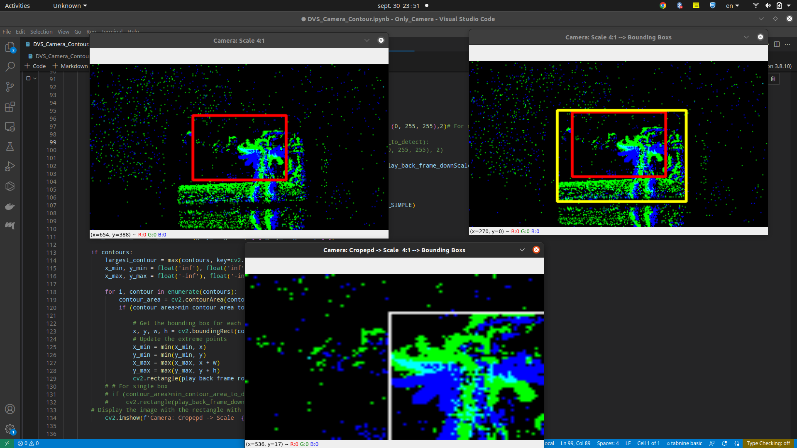
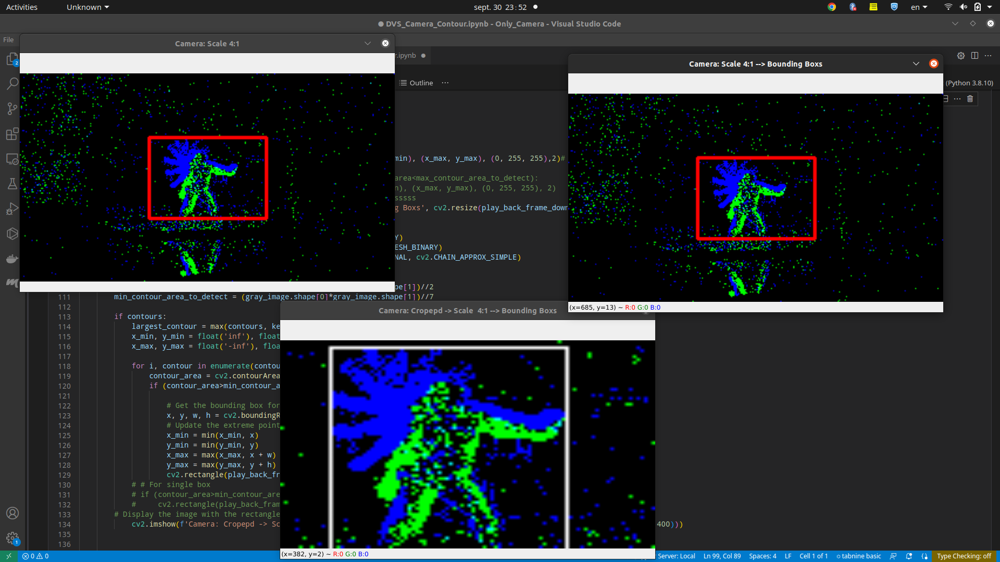
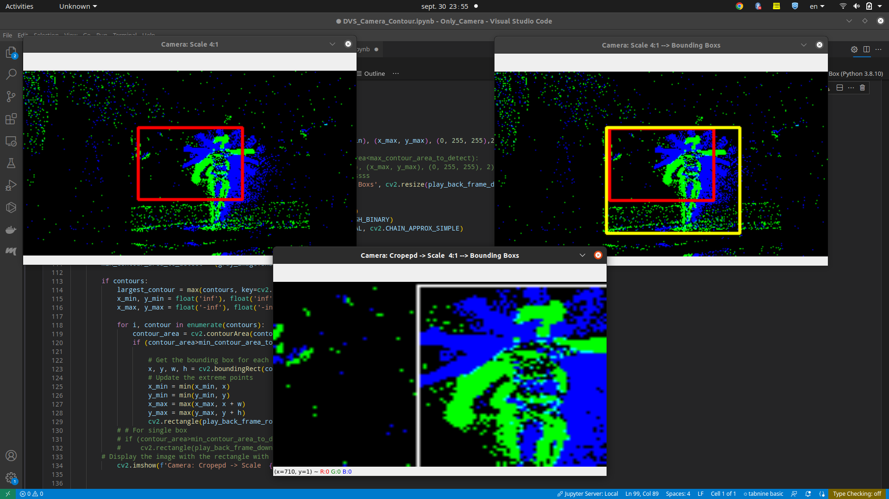

# Sample code to get started with Metavision SDK 
### event-camera-evk4 (https://www.prophesee.ai/event-camera-evk4/)

A simple example showing how to manipulate the event stream directly using Metavision SDK and OpenCV.

`NOTE:`
You can also use [`metavision_sdk_ui`](https://docs.prophesee.ai/stable/get_started/get_started_python.html) for displaying and [`tonic`](https://github.com/neuromorphs/tonic) for manipulating

---

- ## **Screenshots**
  

